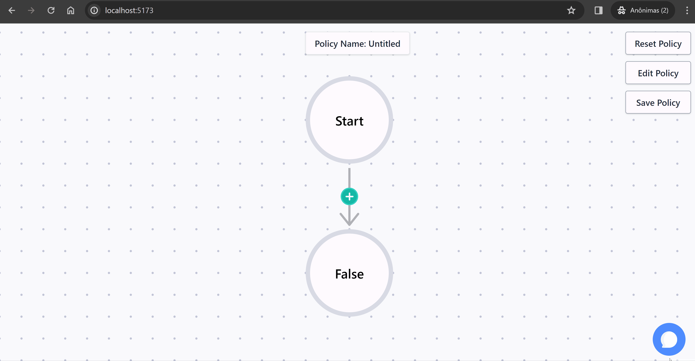

# Frontend

It's the UI for creating, editing and storing one Policy. 

## Tech used

- React (vite)
- TypeScript
- ReactFlow
- Tailwind
- Framer-Motion

## How to run

```shell
yarn dev
```
## Linting

```shell
yarn lint
```

## Docs

### Nodes + Edges

On `pages/GraphEditor/Nodes` you can see we currently have 3 node types: Start,
End and Conditional. All of them have no functionality implemented, only visuals
(which can also be changed if you want).

Between two nodes, there is an edge of the type `add-node`, which has a button
that when clicked, opens a Drawer to add a new node between the two.

### Contexts

In the root page we have 3 contexts:

- editor: For UI stuff, for example the Drawer state.
- graph: ReactFlow-related states and functions, to add nodes, zoom graph and
  more.
- policy: Responsible for holding Policy information and related operations such as changing it's own name.

### Utility

We already have pre-existing functions to help you with the graph, for
positioning and also nodes/edges. They are the files: `nodeGeneration.ts` and
`positionNodes.ts`.

### AI Assistant (in progress)

<div align="center">
  
</div>

The AI Assistant is available in the bottom right corner of the board. Its purpose is to assist the user in getting through his/her problem-solving. Also, for providing answers related to the documentation. 

It's possible through the ChatGPT API. All training and response generation is done by the OpenAI model. 

### Connection Loss or Slow

In the scenario of slow/aborted connection the http-client (axios) wll retry the request three times before emitting an error message. 

For offline requests an Error is thrown by the `handlesOfflineRequest` function.